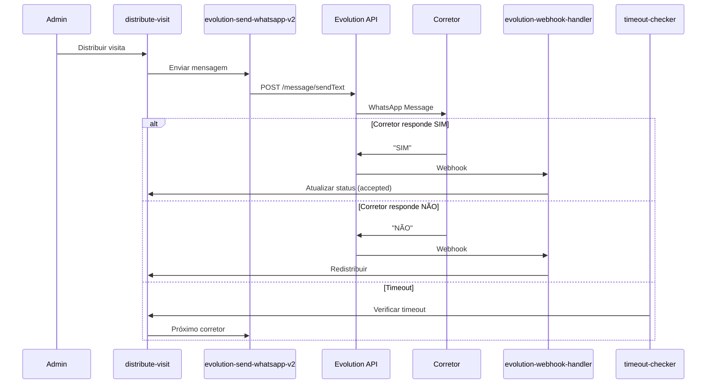

# WhatsApp Messaging - Evolution API V2

## 📋 Índice
- [Visão Geral](#visão-geral)
- [Estrutura da API](#estrutura-da-api)
- [Envio de Mensagens](#envio-de-mensagens)
- [Processamento de Respostas](#processamento-de-respostas)
- [Monitoramento](#monitoramento)
- [Troubleshooting](#troubleshooting)

---

## Visão Geral

Este documento descreve a implementação de mensagens WhatsApp usando a **Evolution API V2** no sistema de distribuição de visitas.

### ⚠️ Importante: Sem Botões Interativos

A Evolution API V2 **não suporta botões reply tradicionais** da forma esperada. O endpoint `/sendButton` é usado para **polls (enquetes)**, não para botões de resposta rápida.

**Solução adotada:** Mensagens de texto simples com instruções claras.

### ✅ Vantagens da Abordagem Atual

- **100% de compatibilidade** - Funciona em qualquer versão do WhatsApp
- **Confiável** - Sem dependência de recursos específicos do cliente
- **Simples** - Fácil de entender para os corretores
- **Testável** - Respostas podem ser testadas manualmente

---

## Estrutura da API

### Endpoint: Enviar Texto

```http
POST https://sua-api.com/message/sendText/{instanceName}
Content-Type: application/json
apikey: SUA_API_KEY

{
  "number": "5585996227722",
  "text": "Sua mensagem aqui"
}
```

### ⚠️ Estrutura Correta

**CORRETO** (Evolution API V2):
```json
{
  "number": "5585996227722",
  "text": "Mensagem de texto"
}
```

**INCORRETO** (não funciona):
```json
{
  "number": "5585996227722",
  "message": "...",  // ❌ Campo errado
  "options": {},     // ❌ Não existe
  "delay": 1000      // ❌ Não suportado
}
```

### Resposta da API

```json
{
  "key": {
    "remoteJid": "5585996227722@s.whatsapp.net",
    "fromMe": true,
    "id": "3EB0A1B2C3D4E5F6"
  },
  "message": {
    "conversation": "Sua mensagem aqui"
  },
  "messageTimestamp": "1234567890",
  "status": "PENDING"
}
```

**Message ID:** `result.key.id` (exemplo: `"3EB0A1B2C3D4E5F6"`)

---

## Envio de Mensagens

### Função: `evolution-send-whatsapp-v2`

**Localização:** `supabase/functions/evolution-send-whatsapp-v2/index.ts`

#### Payload Esperado

```typescript
{
  phone_number: string;      // Formato: 5585996227722
  message: string;           // Texto da mensagem
  lead_id?: string;         // ID do lead (opcional)
  corretor_id?: string;     // ID do corretor (opcional)
}
```

#### Exemplo de Uso

```typescript
const { data, error } = await supabase.functions.invoke(
  'evolution-send-whatsapp-v2',
  {
    body: {
      phone_number: '5585996227722',
      message: '🏠 *NOVA OPORTUNIDADE DE VISITA*\n\n...',
      lead_id: 'uuid-do-lead',
      corretor_id: 'uuid-do-corretor'
    }
  }
);

// Extrair message_id da resposta
const messageId = data?.result?.key?.id;
```

### Formato da Mensagem de Distribuição

```
🏠 *NOVA OPORTUNIDADE DE VISITA*

*Cliente:* João Silva
*Telefone:* (85) 99622-7722
*E-mail:* joao@email.com
*Empreendimento:* Residencial Exemplo
*Data:* 18/11/2025
*Horário:* 14:00

⏰ *Você tem 15 minutos para responder.*

➡️ *Como responder:*
✅ Digite *SIM* para aceitar esta visita
❌ Digite *NÃO* para recusar

_Aguardamos sua resposta!_
```

### Formatação WhatsApp

- `*texto*` - **Negrito**
- `_texto_` - _Itálico_
- `~texto~` - ~~Tachado~~
- ``` - Monoespaçado
- Emojis são suportados: 🏠 ✅ ❌ ⏰

---

## Processamento de Respostas

### Webhook Handler

**Localização:** `supabase/functions/evolution-webhook-handler/index.ts`

#### Estrutura do Webhook

```json
{
  "event": "messages.upsert",
  "instance": "SuaInstancia",
  "data": {
    "key": {
      "remoteJid": "5585996227722@s.whatsapp.net",
      "fromMe": false,
      "id": "MESSAGE_ID"
    },
    "message": {
      "conversation": "SIM"
    },
    "messageType": "conversation",
    "messageTimestamp": 1234567890
  }
}
```

#### Extração de Mensagem

Prioridade de processamento:

1. `data.message.conversation` (texto simples)
2. `data.message.extendedTextMessage.text` (texto formatado)
3. Outros tipos (ignorados)

#### Normalização de Resposta

```typescript
function normalizeResponse(text: string): string {
  return text
    .trim()
    .toLowerCase()
    .replace(/[^\w\s]/gi, ''); // Remove emojis e pontuação
}

// Exemplos:
normalizeResponse("✅ SIM") → "sim"
normalizeResponse("NÃO") → "nao"
normalizeResponse("Sim!") → "sim"
```

#### Análise de Resposta

```typescript
function analyzeResponse(message: string) {
  const normalized = normalizeResponse(message);
  
  const acceptKeywords = ['sim', 'aceito', 'ok', 'quero', 'yes'];
  const rejectKeywords = ['nao', 'não', 'recuso', 'negativo', 'no'];
  
  if (acceptKeywords.some(k => normalized.includes(k))) {
    return { type: 'accepted', confidence: 1.0 };
  }
  
  if (rejectKeywords.some(k => normalized.includes(k))) {
    return { type: 'rejected', confidence: 1.0 };
  }
  
  return { type: 'unclear', confidence: 0.0 };
}
```

---

## Monitoramento

### Taxa de Sucesso

```sql
SELECT 
  COUNT(*) as total_envios,
  SUM(CASE WHEN status = 'sent' THEN 1 ELSE 0 END) as enviados,
  SUM(CASE WHEN status = 'failed' THEN 1 ELSE 0 END) as falhados,
  ROUND(100.0 * SUM(CASE WHEN status = 'sent' THEN 1 ELSE 0 END) / COUNT(*), 2) as taxa_sucesso_percentual
FROM communication_log
WHERE created_at > NOW() - INTERVAL '24 hours'
  AND type = 'whatsapp'
  AND direction = 'enviado';
```

### Distribuições Pendentes

```sql
SELECT 
  v.id as visita_id,
  l.nome as lead_nome,
  c.creci as corretor_creci,
  vda.created_at as enviado_em,
  vda.timeout_at as expira_em,
  EXTRACT(EPOCH FROM (vda.timeout_at - NOW()))/60 as minutos_restantes
FROM visit_distribution_attempts vda
JOIN visitas v ON v.id = vda.visita_id
JOIN leads l ON l.id = v.lead_id
JOIN corretores c ON c.id = vda.corretor_id
WHERE vda.status = 'pending'
  AND vda.timeout_at > NOW()
ORDER BY vda.timeout_at ASC;
```

### Respostas Processadas

```sql
SELECT 
  response_type,
  COUNT(*) as total,
  AVG(EXTRACT(EPOCH FROM (response_received_at - message_sent_at))/60) as tempo_medio_resposta_minutos
FROM visit_distribution_attempts
WHERE response_type IS NOT NULL
  AND created_at > NOW() - INTERVAL '7 days'
GROUP BY response_type;
```

### Logs de Edge Function

```bash
# Via Supabase Dashboard
https://supabase.com/dashboard/project/{PROJECT_ID}/functions/evolution-send-whatsapp-v2/logs

# Filtros úteis:
# - 📤 Request para Evolution API v2
# - 📥 Response status
# - ✅ Message sent successfully
# - ❌ Evolution API error
```

---

## Troubleshooting

### Problema: Mensagem não é enviada

**Sintomas:**
- Error: "Erro ao enviar mensagem (status 400)"
- Logs mostram payload incorreto

**Solução:**
1. Verificar estrutura do payload (apenas `number` e `text`)
2. Validar formato do número (5585996227722)
3. Checar configurações da Evolution API no `system_settings`

```sql
SELECT key, value 
FROM system_settings 
WHERE key IN ('evolution_api_url', 'evolution_api_key', 'evolution_instance_name');
```

### Problema: Resposta não é processada

**Sintomas:**
- Corretor responde mas status permanece "pending"
- Webhook recebido mas não processa

**Solução:**
1. Verificar logs do `evolution-webhook-handler`
2. Validar estrutura do webhook recebido
3. Conferir normalização de texto:

```typescript
// Teste manual de normalização
const response = "✅ SIM!";
const normalized = response.trim().toLowerCase().replace(/[^\w\s]/gi, '');
console.log(normalized); // deve retornar "sim"
```

### Problema: Timeout não redistribui

**Sintomas:**
- Tentativa expira mas não vai para próximo corretor
- Status fica "pending" após timeout

**Solução:**
1. Verificar se `visit-distribution-timeout-checker` está rodando
2. Checar logs do timeout checker
3. Validar cron job:

```sql
SELECT cron.schedule(
  'visit-distribution-timeout-check',
  '*/2 * * * *',  -- A cada 2 minutos
  $$
  SELECT net.http_post(
    url := 'https://oxybasvtphosdmlmrfnb.supabase.co/functions/v1/visit-distribution-timeout-checker',
    headers := '{"Content-Type": "application/json", "Authorization": "Bearer ' || current_setting('app.settings.service_role_key') || '"}'::jsonb,
    body := '{}'::jsonb
  );
  $$
);
```

### Problema: Message ID não é registrado

**Sintomas:**
- `whatsapp_message_id` fica NULL
- Logs mostram mensagem enviada com sucesso

**Solução:**
1. Verificar extração do message_id:

```typescript
// Evolution API V2 retorna:
const messageId = result?.key?.id;

// ❌ INCORRETO:
const messageId = result?.messageId; // Não existe na V2
```

2. Atualizar código para buscar em `result.key.id`

---

## Fluxo Completo



---

## Checklist de Implementação

- [x] Função `evolution-send-whatsapp-v2` criada
- [x] Payload correto (apenas `number` e `text`)
- [x] Logs detalhados de request/response
- [x] Mensagem formatada com instruções claras
- [x] Webhook handler processa respostas de texto
- [x] Normalização de respostas (remove emojis)
- [x] Extração correta de `message_id` (`result.key.id`)
- [x] Timeout checker redistribui automaticamente
- [x] Communication log registra todos os envios
- [x] Documentação atualizada
- [x] Testes manuais realizados

---

## Próximos Passos

1. **Fase 5:** Testes completos do fluxo
2. **Fase 6:** Remoção de funções legadas
3. **Fase 7:** Monitoramento contínuo

---

## Links Úteis

- [Evolution API V2 Docs - Send Text](https://doc.evolution-api.com/v2/api-reference/message-controller/send-text)
- [Evolution API V2 Docs - Webhooks](https://doc.evolution-api.com/v2/pt/configuration/webhooks)
- [Supabase Edge Functions Logs](https://supabase.com/dashboard/project/oxybasvtphosdmlmrfnb/functions/evolution-send-whatsapp-v2/logs)
- [Webhook Handler Logs](https://supabase.com/dashboard/project/oxybasvtphosdmlmrfnb/functions/evolution-webhook-handler/logs)

---

**Última atualização:** 2025-11-18  
**Versão:** 2.0 (Correção completa Evolution API V2)
